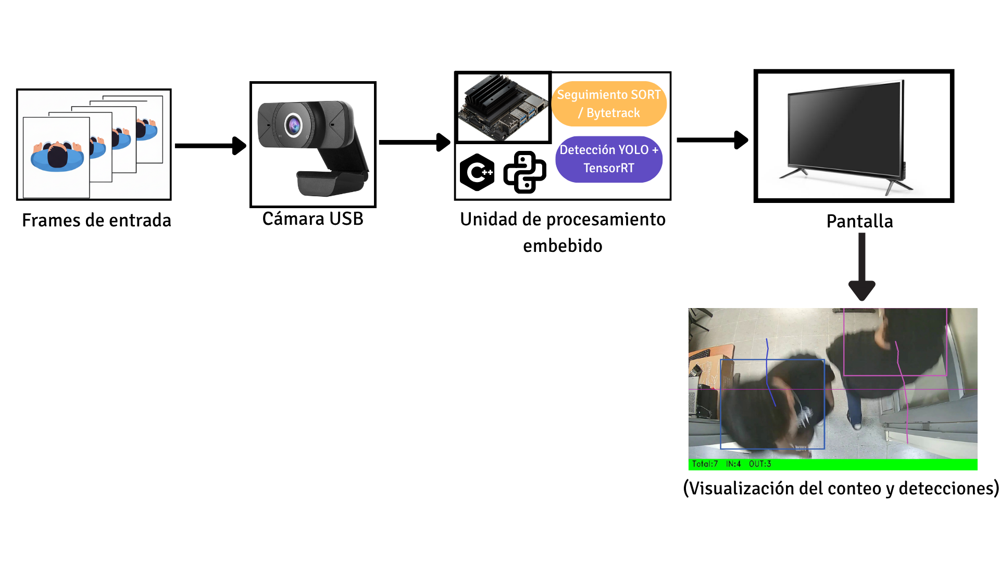
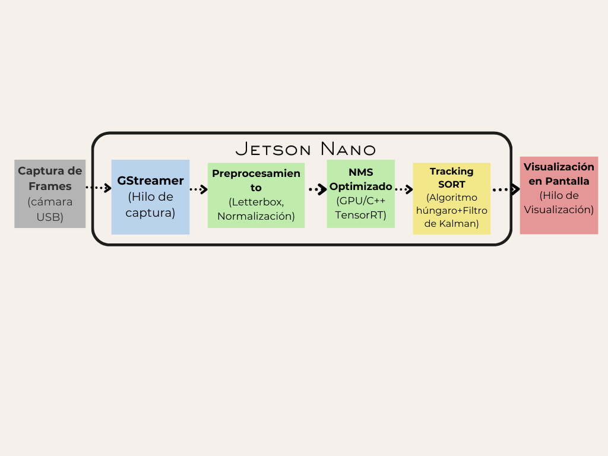
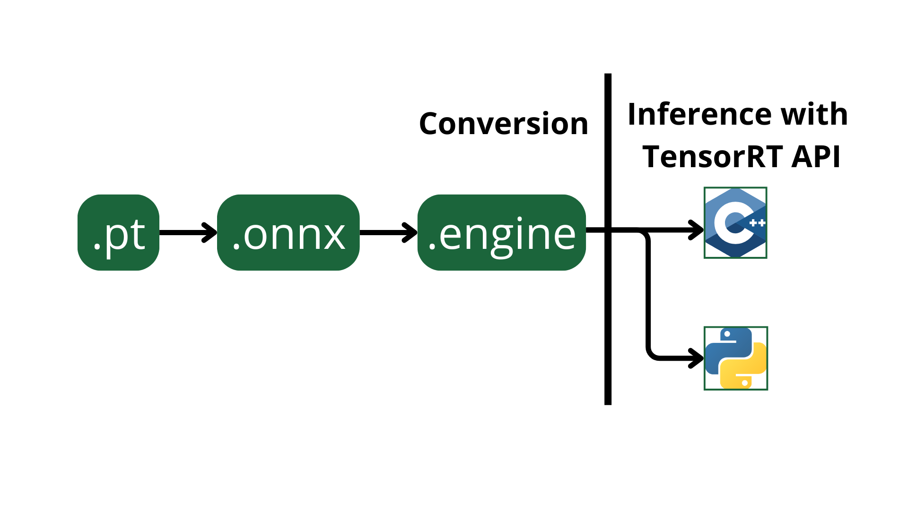
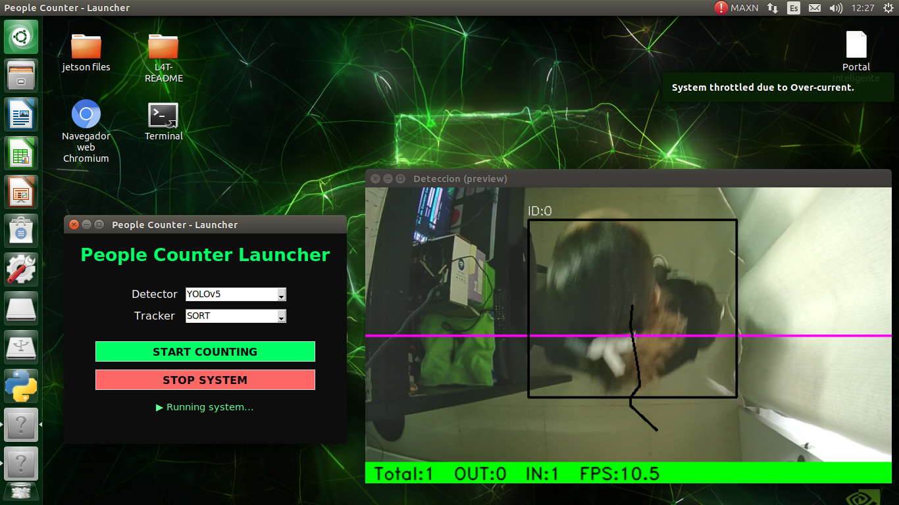

# Intelligent People-Counting Portal 🚪📊

An **Intelligent Portal System for People Counting** using computer vision and deep learning, designed for **Edge Computing** on an NVIDIA Jetson Nano. This system enables precise, real-time, bidirectional counting (entries and exits) without cloud dependency, ensuring low latency and data privacy.

---

## 📌 Project Overview

This project implements an overhead (top-down) vision system to monitor occupant flow through access points. By processing video frames locally, the system detects individuals, tracks their movement, and records crossings through a virtual line.

**Key Goals:**
* **Real-time Detection:** Leveraging YOLO models optimized for embedded hardware.
* **Local Processing:** 100% offline operation on NVIDIA Jetson Nano.
* **High Performance:** Optimized inference using NVIDIA TensorRT (FP16).
* **Data Privacy:** No video data leaves the local device.

---

## 🧠 System Architecture

### 1️⃣ General System Diagram
The complete flow from video acquisition and frame pre-processing to visualization.

### 2️⃣ Block Diagram
Internal component interaction and data flow optimized for the Jetson Nano environment.

---

## 🔄 Optimization & Multithreading

To maintain a stable frame rate on low-resource hardware, the system utilizes a **three-thread architecture**:
1.  **Capture Thread:** Frame acquisition via GStreamer.
2.  **Processing Thread:** Inference (TensorRT), Tracking (SORT), and counting logic.
3.  **Visualization Thread:** Real-time UI rendering and statistics display.

### Model Conversion Pipeline (.pt → .onnx → .engine)
Deep learning models are converted to **TensorRT Engines with FP16 precision** to maximize CUDA core utilization.

---

## 📊 Performance & Results

Based on the statistical validation of **317 real crossing events** under varied lighting and density conditions:

| Metric | YOLOv5s + SORT (Optimized) |
| :--- | :--- |
| **Precision** | 0.95 |
| **Recall** | 0.88 |
| **F1-Score** | 0.91 |
| **MOTA (Tracking Accuracy)** | 0.72 |
| **Inference Speed** | **11 FPS** (Stable on Jetson Nano) |

> **Finding:** YOLOv5s combined with the SORT algorithm proved to be the most stable and reliable configuration for this hardware compared to newer YOLOv11 variants.

---

## ⚙️ Technologies Used

* **Hardware:** NVIDIA Jetson Nano (4GB), EasyULT Webcam Full HD 1080p.
* **Deep Learning:** YOLOv5s, YOLOv11s.
* **Inference Engine:** NVIDIA TensorRT (FP16), CUDA, cuDNN.
* **Tracking:** SORT (Simple Online and Realtime Tracking).
* **Software:** Python, OpenCV, GStreamer, PyTorch.

---

## 🖥️ User Interface

The system features a graphical launcher that allows users to select models, tracking algorithms, and monitor live statistics.

*Figure: Real-time interface showing detection bounding boxes, unique IDs, and IN/OUT counters.*

---

## 👨‍💻 Author

**Andrés Fábregas**  
Electronic Engineer & Software Developer  

Portfolio: https://byandresfabregas.vercel.app/

---

