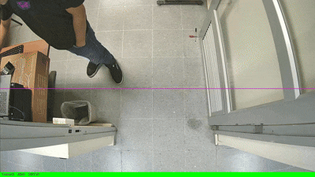

<!-- ========================================================= -->
<!-- INTELLIGENT PEOPLE COUNTING PORTAL — FINAL SHOWCASE -->
<!-- ========================================================= -->

 

  

  

<strong style="color:#7CFF9B;">
Computer Vision · Deep Learning · Edge Computing
</strong>

---

An <strong>Intelligent Portal System for People Counting</strong> using computer vision and deep learning, designed for <strong>Edge Computing</strong> on an <strong>NVIDIA Jetson Nano</strong>. 
The system performs <strong>real-time, bidirectional counting</strong> (entries and exits) completely <strong>offline</strong>, ensuring <strong>low latency</strong> and <strong>data privacy</strong>.

---

## 🟢 Project Demo (Video)

  

<strong style="color:#4EE31C;">
✔ Click to watch the full system demo on YouTube
</strong>

---

## 🟢 System Output (Live Inference)

  

<strong style="color:#7CFF9B;">
✔ Real-time detection, tracking IDs, and IN / OUT counting running fully on-device
</strong>

---

## 🟢 Project Overview

This project implements an <strong>overhead (top-down) vision system</strong> to monitor occupant flow through access points. 
By processing video frames locally, the system detects individuals, tracks their trajectories, and registers crossings through a virtual line.

<strong>🟢 Core Capabilities</strong>

<table width="100%">
<tr>
<td width="50%">

✔ <strong>Real-Time Detection</strong> 
YOLO models optimized for embedded hardware 
Low-latency inference 
Overhead vision for robust tracking

</td>
<td width="50%">

✔ <strong>Privacy-First Design</strong> 
100% local processing 
Zero cloud dependency 
No external video transmission

</td>
</tr>
<tr>
<td width="50%">

✔ <strong>High Performance</strong> 
TensorRT FP16 acceleration 
Multi-threaded execution 
Stable 11 FPS operation

</td>
<td width="50%">

✔ <strong>Bidirectional Tracking</strong> 
Entry / exit counting 
SORT-based trajectory analysis 
Virtual line crossing logic

</td>
</tr>
</table>

---

## 🟢 System Architecture

### General System Flow

 

### Internal Block Architecture

---

## 🟢 Performance & Results

<table style="width:80%;">
<thead>
<tr style="background:linear-gradient(90deg,#66FF6644,transparent); color:#66FF66;">
<th align="left">Metric</th>
<th align="center">YOLOv5s + SORT</th>
</tr>
</thead>
<tbody>
<tr><td>Precision</td><td align="center">0.95</td></tr>
<tr><td>Recall</td><td align="center">0.88</td></tr>
<tr><td>F1-Score</td><td align="center">0.91</td></tr>
<tr><td>MOTA</td><td align="center">0.72</td></tr>
<tr><td><strong>Inference Speed</strong></td><td align="center"><strong>11 FPS</strong></td></tr>
</tbody>
</table>

---

## 🟢 Tech Stack

<table width="100%">
<tr>
<td width="50%" valign="top">

### Hardware Platform
<pre style="background:#0d1117; color:#9AFF9A; border:1px solid #4EE31C55; border-radius:12px; padding:16px;">
NVIDIA Jetson Nano (4GB)
• 128 CUDA Cores
• Quad-core ARM Cortex-A57
• 4GB LPDDR4

EasyULT Webcam Full HD
• 1080p @ 30 FPS
• USB Interface
• Top-down mounting
</pre>

</td>
<td width="50%" valign="top">

### Software Stack
<pre style="background:#0d1117; color:#9AFF9A; border:1px solid #4EE31C55; border-radius:12px; padding:16px;">
YOLOv5s, YOLOv11s
TensorRT (FP16)
CUDA, cuDNN
OpenCV, GStreamer
SORT Tracking
PyTorch
</pre>

</td>
</tr>
</table>

---

 

<strong style="color:#9AFF9A; letter-spacing:1px;">
Electronic Engineer · Software Developer · Edge AI Specialist
</strong>

  

  

✔ Building high-performance computer vision systems for the edge

---
