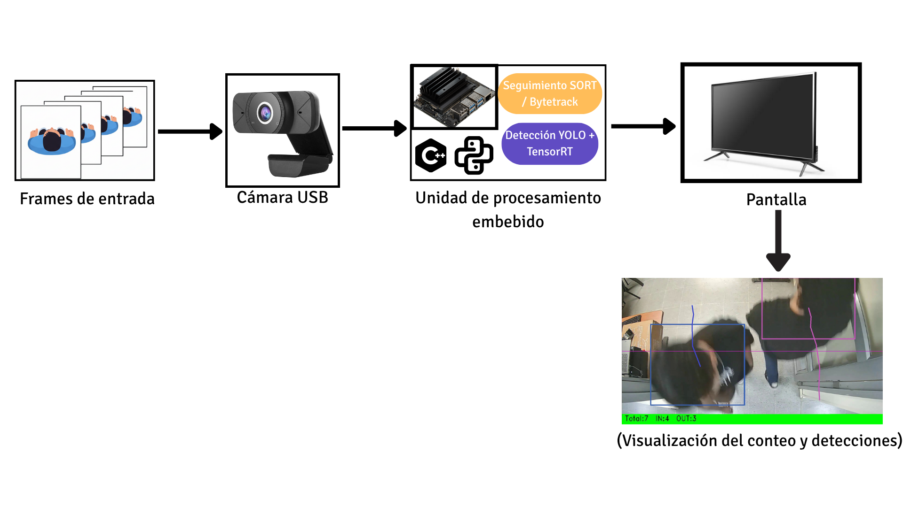
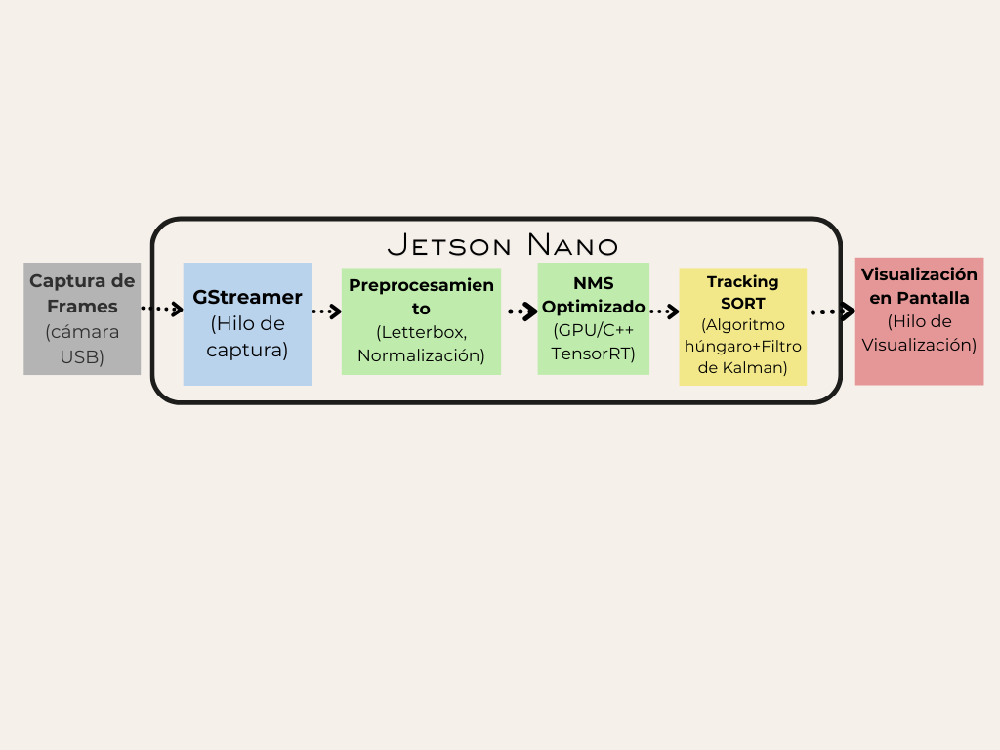
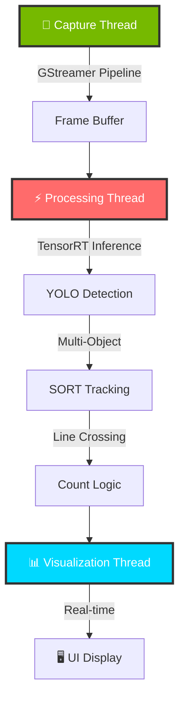
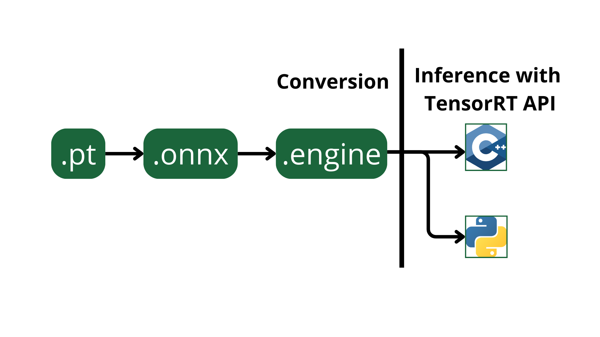
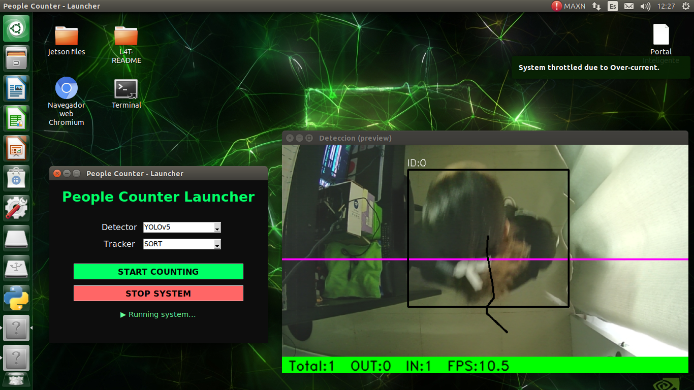

<div align="center">

# 🚪 Intelligent People-Counting Portal 📊


[](https://developer.nvidia.com/embedded/jetson-nano)
[](https://developer.nvidia.com/tensorrt)
[](https://github.com/ultralytics/yolov5)
[](https://www.python.org/)
[](https://developer.nvidia.com/cuda-toolkit)

### 🎯 **Intelligent Portal System for People Counting** 
*Computer Vision + Deep Learning on Edge Computing*

**Real-time • Bidirectional • Privacy-First • 11 FPS on Embedded Hardware**

<br>

</div>

---

<div align="center">

## 📌 Project Overview

</div>

This project implements an **overhead (top-down) vision system** to monitor occupant flow through access points. By processing video frames locally, the system detects individuals, tracks their movement, and records crossings through a virtual line.

<br>

<div align="center">

### 🎯 Key Goals

</div>

<table>
<tr>
<td align="center" width="25%">


### 🔥 Real-time Detection
Leveraging YOLO models optimized for embedded hardware

</td>
<td align="center" width="25%">


### 💻 Local Processing
100% offline operation on NVIDIA Jetson Nano

</td>
<td align="center" width="25%">


### ⚡ High Performance
Optimized inference using NVIDIA TensorRT (FP16)

</td>
<td align="center" width="25%">


### 🔒 Data Privacy
No video data leaves the local device

</td>
</tr>
</table>

<br>

---

<div align="center">

## 🧠 System Architecture

</div>

<br>

### 1️⃣ General System Diagram

<div align="center">

*The complete flow from video acquisition and frame pre-processing to visualization*

<br>



</div>

<br>

### 2️⃣ Block Diagram

<div align="center">

*Internal component interaction and data flow optimized for the Jetson Nano environment*

<br>



</div>

<br>

---

<div align="center">

## 🔄 Optimization & Multithreading

</div>

To maintain a stable frame rate on low-resource hardware, the system utilizes a **three-thread architecture**:

<br>

<div align="center">


```mermaid
graph TD
    A[🎥 Capture Thread] -->|GStreamer Pipeline| B[Frame Buffer]
    B --> C[⚡ Processing Thread]
    C -->|TensorRT Inference| D[YOLO Detection]
    D -->|Multi-Object| E[SORT Tracking]
    E -->|Line Crossing| F[Count Logic]
    F --> G[📊 Visualization Thread]
    G -->|Real-time| H[🖥️ UI Display]
    
    style A fill:#76B900,stroke:#333,stroke-width:3px,color:#fff
    style C fill:#FF6B6B,stroke:#333,stroke-width:3px,color:#fff
    style G fill:#00D9FF,stroke:#333,stroke-width:3px,color:#fff
```

</div>

<br>

<table align="center">
<tr>
<td align="center" width="33%">

**🎥 Thread 1: Capture**  
Frame acquisition via GStreamer

</td>
<td align="center" width="33%">

**⚡ Thread 2: Processing**  
Inference (TensorRT), Tracking (SORT), counting logic

</td>
<td align="center" width="33%">

**📊 Thread 3: Visualization**  
Real-time UI rendering and statistics display

</td>
</tr>
</table>

<br>

### Model Conversion Pipeline (.pt → .onnx → .engine)

<div align="center">

*Deep learning models are converted to **TensorRT Engines with FP16 precision** to maximize CUDA core utilization*

<br>

```
╔═══════════════╗      ╔═══════════════╗      ╔═══════════════╗
║   YOLOv5s     ║      ║     ONNX      ║      ║   TensorRT    ║
║   .pt file    ║ ───► ║  Intermediate ║ ───► ║   .engine     ║
╚═══════════════╝      ╚═══════════════╝      ╚═══════════════╝
   PyTorch                  Universal           FP16 + CUDA
   Weights                  Format              Optimized
```

<br>



</div>

<br>

---

<div align="center">

## 📊 Performance & Results

</div>

<div align="center">

### 🎯 Statistical Validation: **317 Real Crossing Events**
*Under varied lighting and density conditions*

<br>

<table>
<thead>
<tr>
<th align="left">🏆 Metric</th>
<th align="center">YOLOv5s + SORT (Optimized)</th>
</tr>
</thead>
<tbody>
<tr>
<td align="left"><b>Precision</b></td>
<td align="center"></td>
</tr>
<tr>
<td align="left"><b>Recall</b></td>
<td align="center"></td>
</tr>
<tr>
<td align="left"><b>F1-Score</b></td>
<td align="center"></td>
</tr>
<tr>
<td align="left"><b>MOTA (Tracking Accuracy)</b></td>
<td align="center"></td>
</tr>
<tr>
<td align="left"><b>Inference Speed</b></td>
<td align="center"></td>
</tr>
</tbody>
</table>

</div>

<br>

> **💡 Finding:** YOLOv5s combined with the SORT algorithm proved to be the most stable and reliable configuration for this hardware compared to newer YOLOv11 variants.

<br>

---

<div align="center">

## ⚙️ Technologies Used

</div>

<br>

<div align="center">

<table>
<tr>
<td align="center" width="33%">


### 🔧 Hardware

**NVIDIA Jetson Nano (4GB)**  
EasyULT Webcam Full HD 1080p

</td>
<td align="center" width="33%">


### 🧠 Deep Learning

**YOLOv5s, YOLOv11s**  
NVIDIA TensorRT (FP16)  
CUDA, cuDNN

</td>
<td align="center" width="33%">


### 💻 Software

**Python, OpenCV**  
GStreamer, PyTorch  
SORT (Tracking)

</td>
</tr>
</table>

</div>

<br>

---

<div align="center">

## 🖥️ User Interface

</div>

<br>

<div align="center">

*The system features a graphical launcher that allows users to select models, tracking algorithms, and monitor live statistics*

<br>



<br>

**Real-time interface showing detection bounding boxes, unique IDs, and IN/OUT counters**

</div>

<br>

---

<div align="center">

## 👨‍💻 Author

<br>


<br>

**Electronic Engineer & Software Developer**

<br>

[](https://byandresfabregas.vercel.app/)
[](https://github.com)
[](https://linkedin.com)

</div>

<br>

---

<div align="center">


**⚡ Powered by NVIDIA Jetson Nano | Built with ❤️ for Edge AI**

</div>
