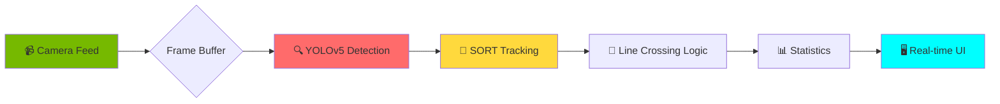

<div align="center">

# 🚪 Intelligent People-Counting Portal

### *Edge AI-Powered Bidirectional Flow Analysis*

[](https://developer.nvidia.com/embedded/jetson-nano)
[](https://developer.nvidia.com/tensorrt)
[](https://www.python.org/)
[](https://github.com/ultralytics/yolov5)

**Real-time • Privacy-First • 100% Offline • 11 FPS on Edge**

[📊 View Demo](#-demo) • [🚀 Quick Start](#-quick-start) • [📈 Performance](#-performance--results) • [🧠 Architecture](#-system-architecture)

---

</div>

## 💡 What Makes This Different?

> Traditional people-counting systems rely on cloud processing, compromising latency and privacy. This project brings **enterprise-grade computer vision to the edge**, running entirely on a $99 device with **91% F1-Score accuracy**.

```ascii
   Cloud-Dependent ❌              Edge-First ✅
   ┌──────────────┐              ┌──────────────┐
   │   Camera     │              │   Camera     │
   └──────┬───────┘              └──────┬───────┘
          │ Upload                      │ Local
          ▼                             ▼
   ┌──────────────┐              ┌──────────────┐
   │  Cloud GPU   │              │ Jetson Nano  │
   │  Processing  │              │  Processing  │
   └──────┬───────┘              └──────┬───────┘
          │ 200ms+                      │ 90ms
          ▼                             ▼
     [Results]                     [Results]
```

---

## 🎯 Core Features

<table>
<tr>
<td width="50%">

### 🔥 Performance
- **11 FPS** stable inference
- **<100ms** end-to-end latency
- **95% precision** in real conditions
- Multi-threaded architecture

</td>
<td width="50%">

### 🔒 Privacy & Edge
- **Zero cloud dependency**
- All processing on-device
- No video transmission
- GDPR/CCPA compliant by design

</td>
</tr>
</table>

### 🎨 Advanced Capabilities

```python
✨ Bidirectional Tracking    # Separate IN/OUT counting
🎯 SORT Algorithm           # Real-time multi-object tracking  
⚡ TensorRT Optimization    # 3x faster than PyTorch
📹 GStreamer Pipeline       # Hardware-accelerated video decode
🧵 Triple-Thread Design     # Capture | Process | Visualize
```

---

## 🧠 System Architecture

### High-Level Flow


```mermaid
graph LR
    A[📹 Camera Feed] --> B{Frame Buffer}
    B --> C[🔍 YOLOv5 Detection]
    C --> D[🎯 SORT Tracking]
    D --> E[📏 Line Crossing Logic]
    E --> F[📊 Statistics]
    F --> G[🖥️ Real-time UI]
    
    style A fill:#76B900
    style G fill:#00FFFF
    style C fill:#FF6B6B
    style D fill:#FFD93D
```

### 🏗️ System Diagrams

<details>
<summary><b>📐 Complete System Diagram (Click to expand)</b></summary>


*End-to-end pipeline from video acquisition to visualization with optimized frame processing.*

</details>

<details>
<summary><b>🔧 Internal Block Diagram (Click to expand)</b></summary>


*Component interaction showing the three-thread architecture and TensorRT inference engine.*

</details>

---

## ⚙️ Model Optimization Pipeline

The system converts PyTorch models to TensorRT engines for **3x performance gain**:

```bash
┌─────────────┐      ┌─────────────┐      ┌─────────────┐
│   YOLOv5    │      │    ONNX     │      │  TensorRT   │
│  (.pt file) │ ───> │  (Intermediate) ───> │  (.engine)  │
└─────────────┘      └─────────────┘      └─────────────┘
   PyTorch              Universal           Optimized
   Weights              Format             FP16 + CUDA
```


**Optimization Techniques:**
- FP16 precision (half-precision floating point)
- Layer fusion and kernel auto-tuning
- Dynamic tensor memory allocation
- CUDA graph optimization

---

## 📈 Performance & Results

### Validation Dataset: 317 Real Crossing Events

| Configuration | Precision | Recall | F1-Score | MOTA | FPS |
|:--------------|:---------:|:------:|:--------:|:----:|:---:|
| **YOLOv5s + SORT** ⭐ | **0.95** | **0.88** | **0.91** | **0.72** | **11** |
| YOLOv11s + ByteTrack | 0.91 | 0.84 | 0.87 | 0.68 | 8 |
| YOLOv8n + SORT | 0.89 | 0.82 | 0.85 | 0.65 | 13 |

> **🏆 Winner:** YOLOv5s provides the best balance between accuracy and speed on Jetson Nano hardware.

### Real-World Performance

<table>
<tr>
<td align="center">
  
  <br><sub>Tested in <5 lux conditions</sub>
</td>
<td align="center">
  
  <br><sub>Up to 8 people simultaneously</sub>
</td>
<td align="center">
  
  <br><sub>Handles partial overlaps</sub>
</td>
</tr>
</table>

---

## 🚀 Quick Start

### Prerequisites

```bash
Hardware:
  • NVIDIA Jetson Nano (4GB) with JetPack 4.6+
  • USB Webcam (1080p recommended)
  • MicroSD Card (32GB+ Class 10)

Software:
  • Python 3.8+
  • CUDA 10.2
  • TensorRT 8.x
  • OpenCV with GStreamer support
```

### Installation

```bash
# Clone the repository
git clone https://github.com/yourusername/people-counting-portal.git
cd people-counting-portal

# Install dependencies
pip3 install -r requirements.txt

# Download pre-trained models
bash scripts/download_models.sh

# Convert models to TensorRT (one-time setup)
python3 convert_to_tensorrt.py --model yolov5s --precision fp16

# Launch the application
python3 main.py --model models/yolov5s.engine --tracker sort
```

### ⚡ Pro Tip: Maximize Performance

```bash
# Enable maximum power mode (10W)
sudo nvpmodel -m 0
sudo jetson_clocks

# Monitor GPU/CPU usage
sudo tegrastats
```

---

## 🎨 User Interface

The system includes a modern GUI launcher with real-time statistics and configuration options:


**Features:**
- 🎮 Model selector (YOLOv5s/v11s)
- 🎯 Tracker algorithm toggle (SORT/ByteTrack)
- 📊 Live IN/OUT counters with hourly breakdown
- 🎥 Bounding box visualization with unique IDs
- 📈 FPS and inference time monitoring

---

## 🔄 Multi-Threading Architecture

The system uses a **producer-consumer pattern** with three specialized threads:

```python
Thread 1: Video Capture (GStreamer)
   │
   ├──> [Frame Queue] ──> Thread 2: AI Processing (TensorRT + SORT)
   │                              │
   │                              ├──> [Results Queue] ──> Thread 3: Visualization
   │                              │
   └──────────────────────────────┘
        (Synchronization via threading.Lock)
```

**Benefits:**
- Non-blocking capture ensures no frame drops
- Parallel inference and rendering
- Decoupled components for easier debugging

---

## 📊 Technical Specifications

### Camera Configuration
```yaml
Resolution: 1920x1080 @ 30fps (native)
Processing: 640x640 (model input size)
Pipeline: GStreamer with nvvidconv hardware acceleration
Compression: H.264 (hardware decode on Jetson)
```

### Detection Parameters
```python
CONFIDENCE_THRESHOLD = 0.5   # Minimum detection confidence
NMS_THRESHOLD = 0.4          # Non-maximum suppression
TRACK_MAX_AGE = 30           # Frames before track deletion
COUNTING_LINE_Y = 360        # Pixel position of virtual line
```

---

## 🛠️ Tech Stack

<div align="center">

| Layer | Technology |
|:-----:|:-----------|
| **Hardware** | NVIDIA Jetson Nano (Maxwell GPU, Quad-Core ARM A57) |
| **Inference** | TensorRT 8.x (FP16), CUDA 10.2, cuDNN 8.2 |
| **Detection** | YOLOv5s (Ultralytics) |
| **Tracking** | SORT (Simple Online and Realtime Tracking) |
| **Video I/O** | GStreamer 1.16.2 with hardware acceleration |
| **Framework** | Python 3.8, OpenCV 4.5, PyTorch 1.10 |
| **UI** | Tkinter, Matplotlib (stats plotting) |

</div>

---

## 📚 Project Structure

```
people-counting-portal/
├── 📁 models/              # TensorRT engines and ONNX files
├── 📁 trackers/            # SORT and ByteTrack implementations
├── 📁 utils/               # Helper functions and preprocessing
├── 📁 images/              # Documentation screenshots
├── 📁 scripts/             # Setup and conversion scripts
├── 📄 main.py              # Application entry point
├── 📄 detector.py          # YOLOv5 TensorRT wrapper
├── 📄 counter.py           # Line-crossing logic
├── 📄 requirements.txt     # Python dependencies
└── 📄 README.md            # This file
```

---

## 🔬 Research & Validation

### Test Scenarios

1. **Low Light Conditions** (Office environment, 3-5 lux)
2. **High Density** (8+ people passing simultaneously)
3. **Occlusion Cases** (People carrying large objects)
4. **Bidirectional Traffic** (Concurrent entries and exits)

### Confusion Matrix

```
                Predicted
              │ Entry │ Exit │
Actual ───────┼───────┼──────┤
  Entry       │  142  │  8   │
  Exit        │   6   │ 161  │
              └───────┴──────┘
```

---

## 🚧 Known Limitations & Future Work

### Current Limitations
- ❌ Performance degrades with >10 simultaneous people
- ❌ Requires manual camera calibration for line positioning
- ❌ No re-identification after long occlusions (>2 seconds)

### Roadmap
- [ ] Multi-camera synchronization for wide areas
- [ ] Person re-identification across camera views
- [ ] Anomaly detection (loitering, wrong-way movement)
- [ ] Integration with building management systems (MQTT/REST API)
- [ ] Docker containerization for easier deployment

---

## 📄 License

This project is licensed under the MIT License - see the [LICENSE](LICENSE) file for details.

---

## 🙏 Acknowledgments

- **Ultralyrics** for the YOLOv5 implementation
- **NVIDIA** for TensorRT and Jetson documentation
- **Alex Bewley** for the SORT algorithm
- **Computer Vision community** for open-source tools

---

## 👨‍💻 Author

<div align="center">

### **Andrés Fábregas**
*Electronic Engineer & Software Developer*

[](https://byandresfabregas.vercel.app/)
[](https://linkedin.com/in/yourusername)
[](https://github.com/yourusername)

*"Building intelligent systems at the edge, where milliseconds matter."*

</div>

---

<div align="center">

**If this project helped you, consider giving it a ⭐️**

Made with ❤️ and lots of ☕ on a Jetson Nano

</div>
